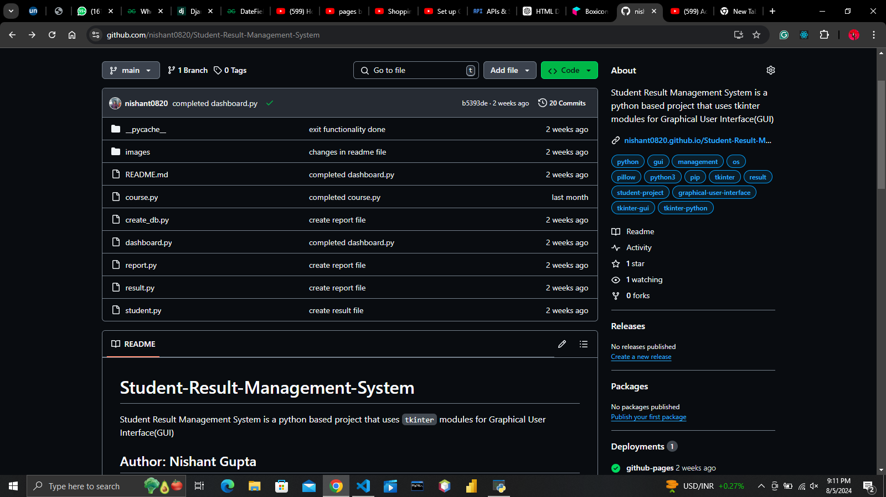
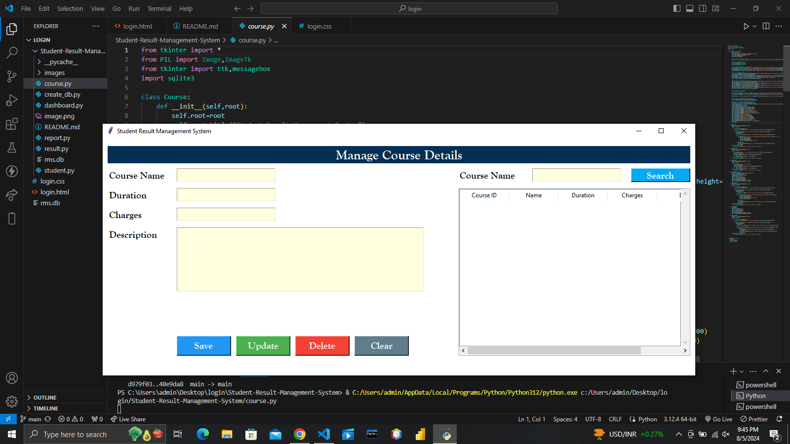
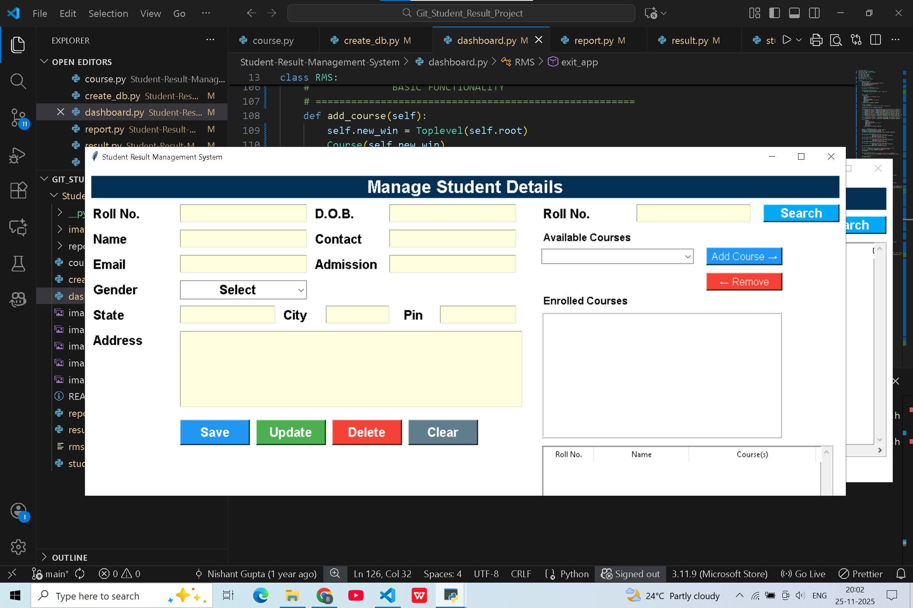
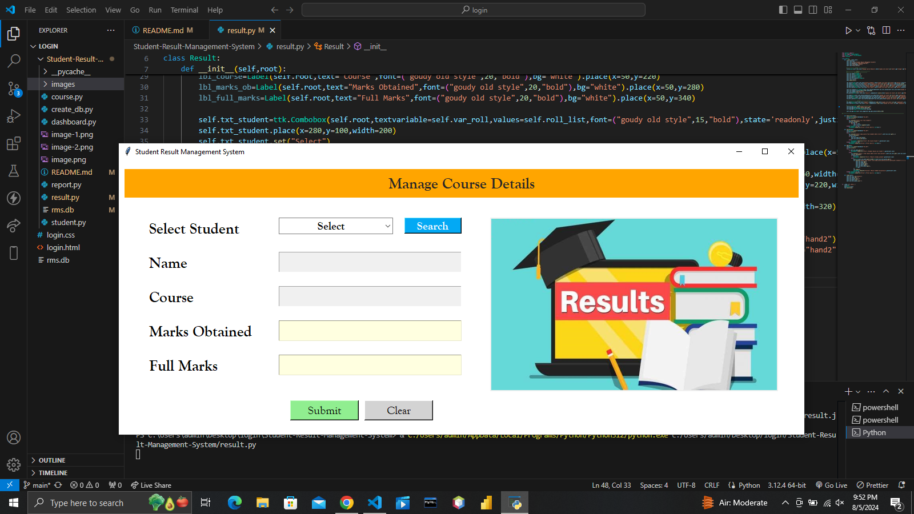
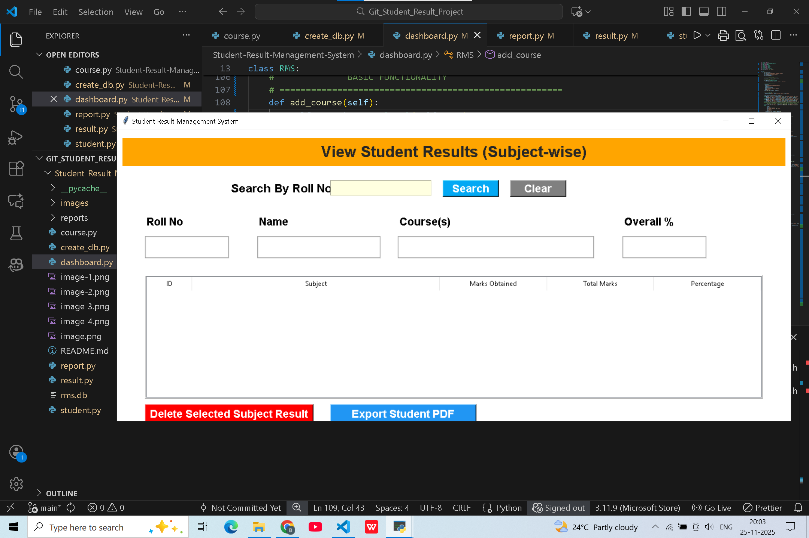

# Student-Result-Management-System
Student Result Management System is a python based project that uses `tkinter` modules for Graphical User Interface(GUI)

## Author: Nishant Gupta

### Overview
This project includes 6 python scripts that demonstrate how to interact with a Graphical User Interface(GUI) using `tkinter`, manage images using `pil`, date/time using `datetime`, database using `sqlite3` and fetching files from system using `os` module. In this project, there are total 6 python scripts which are connected to each other. The six python scripts are as follows:-
1. `dashboard.py`
2. `course.py`
3. `student.py`
4. `result.py`
5. `report.py`
6. `create_db.py`

### 1. dashboard.py
- This script is the dashboard of Student Result Management System containing buttons, images, labels and clock.
- The screen shows the options for `Course`, `Student`, `Result`, `View Result` and `Exit`
- This screen also updates timely as you perform operations on any of these Labels.

### 2. course.py
- This screen collects and shows the complete data regarding the student `course`.
- Buttons are functionalised accordingly.
- You can search any course through its `course name`.

### 3. student.py
- This screen collects and shows the complete data regarding `students`.
- Buttons are functionalised accordingly.
- You can search a particular student details by `roll no.`.

### 4. result.py
- This screen collects the `result` of a student by its roll no.
- Buttons are functionalised accordingly.

### 5. report.py
- This screen shows the complete `report` of student marks.
- Buttons are functionalised accordingly.
- You can search a particular student report through `roll no.`.

### 6. creat_db.py
- This is the database file for all the tables.
- You have to run this file `first` before running the `dashboard.py` file otherwise it will throw an error.

#### Detailed Steps:
1. Click on the `create_db.py` file first and run it.
2. Click on the `dashboard.py` file and run it.
3. Click on the `course button` to add courses.
4. Click on the `student button` to add students.
5. Click on the `result button` to add results.
6. Now click on the `report button` to see the report.
7. Now click on the `exit button` to close it.

### Pre-Requisites
Ensure that you have the following Python Pakages installed in your PC:
- `time`: `pip install time`
- `pil`: `pip install pil`
- `sqlite3`: `pip install sqlite3`
- `os`: `pip install os`

### Configuration
- Before running `dashboard.py`, make sure first to run `create_db.py` file and create a folder named `images`.
- In `images` folder save your images regarding this project.
